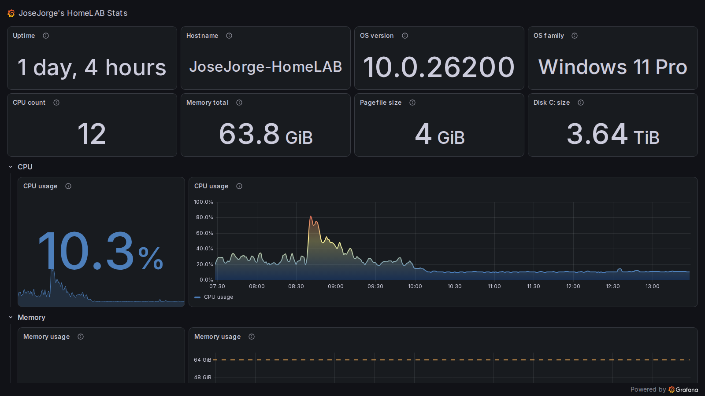

<!-- ===================================================== -->
<!--                ⚡ KYTHEX / JOE PROFILE ⚡              -->
<!-- ===================================================== -->

<p align="center">
  
</p>

<!-- ===================================================== -->
<!--                ANIMATED TERMINAL INTRO                -->
<!-- ===================================================== -->

<p align="center">
  
</p>

---

<h3 align="center"> 🚀 Tech • Cloud • Automation • Innovation  </h3>

<p align="center">
  
</p>

<p align="center">
  
  
  
</p>

---

# ⚡ About Me

```diff
+ Name: Joe / KytheX
+ Role: Senior Operations Manager | Tech Architect
+ Focus: Cloud • Automation • Cybersecurity • GameDev
+ Ecosystem: Parlee • CyperZaX • GoDGuilD
+ Current Mission: Building scalable and secure ecosystems
```
<!-- ===================== ABOUT ===================== -->
- 🔭 Working on **Home Automation + Smart Secure Environments**
- 🌱 Learning **Angular • React • Vue**
- 👯 Collaborating on **RunningRiot**
- 🤝 Exploring **Synergy Fork**
- 💬 Ask me about **Web3 • Virtualization • Automation**
- ⚡ Fun fact: *Clouds weigh ~1 million tons*

---

<p align="center">
<picture>
  
</picture>
</p>

---

# 🧠 Current Focus

```yaml
🚀 Working On:
  - Smart Home Automation
  - Cloud-native Infrastructure
  - Game Development Projects
  - AI-enhanced Workflows

📚 Currently Learning:
  - Angular
  - React
  - Vue
  - Advanced Kubernetes

🎮 Side Quest:
  - RunningRiot
  - VoidInvaders
  - GoDStudioS
```

---

# 🌐 Connect With Me

<p align="center">

<a href="https://codepen.io/josejorge">

</a>

<a href="https://dev.to/josejorge">

</a>

<a href="https://linkedin.com/in/josejorge">

</a>

<a href="https://twitter.com/josejorge">

</a>

<a href="https://github.com/josejorge">

</a>

<a href="https://blog.kythex.com">

</a>

<a href="mailto:me@josejorge.com">

</a>

<a href="https://stackoverflow.com/users/209805">

</a>

<a href="https://instagram.com/josejorgehz">

</a>

<a href="https://www.youtube.com/c/josejorge">

</a>

</p>

---

# 🎮 Discord Status

<p align="center">
  <a href="https://discord.com/users/221872218563543040">
    
  </a>
</p>

---

# 🎮 Ecosystem

<p align="center">


</p>

---

# 🧰 Tech Stack

<details>
<summary><b>💻 Languages</b></summary>

<br>

<p>


</p>

</details>

<details>
<summary><b>🌐 Frontend</b></summary>

<br>

<p>


</p>

</details>

<details>
<summary><b>⚙️ Backend & Infrastructure</b></summary>

<br>

<p>


</p>

</details>

<details>
<summary><b>☁️ Cloud</b></summary>

<br>

<p>


</p>

</details>


<details>
<summary><b>🗄️ Databases</b></summary>

<br>

<p>


</p>

</details>

---

# 🧠 Development Stack

<p align="center">
  </p>

---

# 📡 Infrastructure Status

```yaml
🖥️ Homelab Cluster:
  Status: ONLINE

📦 Containers:
  Docker: ACTIVE
  Kubernetes: HEALTHY

🔐 Security:
  CyperZaX Shield: ENABLED

📡 Network:
  VPN Mesh: STABLE
  Reverse Proxy: ACTIVE

⚡ Automation:
  Scheduled Jobs: RUNNING
```

---

# 📊 Metrics Dashboard

### 🖥️ Live Infrastructure Snapshot

<p align="center">
  
</p>

🔴 Live dashboard:
<p align="center">
  https://josejorgehz.grafana.net/public-dashboards/1846f6b4c2c6454d90a3683f26d3414d
</p>

[](https://josejorgehz.grafana.net/public-dashboards/1846f6b4c2c6454d90a3683f26d3414d)

<p align="center">
  <i>This Grafana public snapshot gets automatically updated every six hours 👀</i>
</p>


---

# 🎵 Now Playing

<p align="center">

[](https://github.com/kittinan/spotify-github-profile)

</p>


---

# 📰 Latest Blog Posts

<!-- BLOG-POST-LIST:START -->
- 🚀 Coming soon...
- ⚡ Auto-updating articles from blog.kythex.com
- 🧠 Automation + Homelab content
<!-- BLOG-POST-LIST:END -->

---

# 🎮 Current Projects

| Project | Description |
|---|---|
| 🎮 RunningRiot | Endless runner chaos |
| 👾 VoidInvaders | Space Invaders-inspired arcade |
| 🛡️ CyperZaX | Security ecosystem |
| ☁️ GoDServerS | Gaming infrastructure |
| 🧠 Parlee | Cloud + automation ecosystem |

---

# ⚡ Quote

<p align="center">

> “Built like a system.  
> Scaled like a cloud.  
> Secured like a fortress.”

</p>

---

# 👀 Visitor Counter

<p align="center">
  
</p>

---

<!-- ===================== STATS ===================== -->
### 📊 GitHub Stats

<p align="center">
  
</p>

---

### 🔥 Streak Stats
<p align="center">
  
</p>

---

### 📈 Activity Graph
<p align="center">
  
</p>

---

<!-- ===================== TROPHIES ===================== -->
### 🏆 Achievements
<p align="center">
  
</p>

---

# ⚡ Final Transmission

<p align="center">

```diff
+ SYSTEM STATUS: OPERATIONAL
+ GOdGUILd NETWORK: CONNECTED
+ CYPERZAX SECURITY: ACTIVE
+ PARLEE ECOSYSTEM: EXPANDING
```

</p>

---

<p align="center">
  
</p>

---

<!-- ===================== FOOTER ===================== -->
<p align="center">
  ⚡ Built with passion, automation, and a bit of chaos ⚡
</p>
